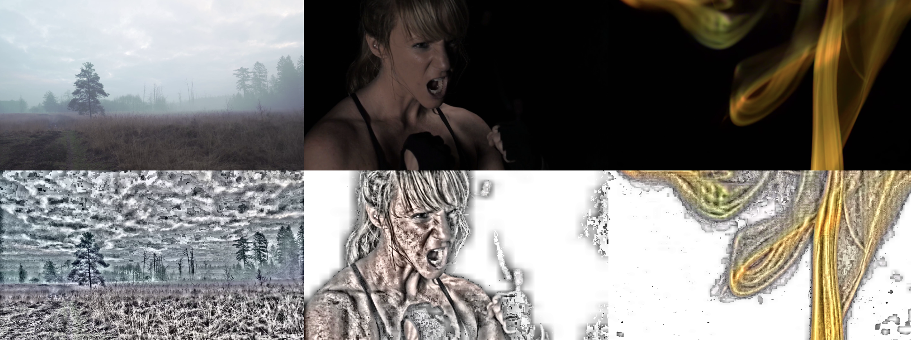
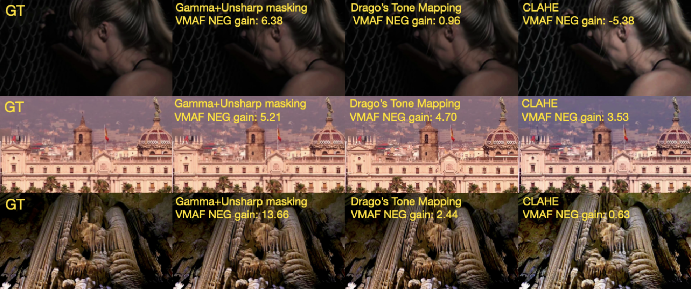

<p align="center">

  <h2 align="center">Hacking VMAF and VMAF NEG: Vulnerability to Different Preprocessing Methods</h2>
  <p align="center">
    <a href="https://scholar.google.com/citations?user=Siniukov"><strong>Maksim Siniukov</strong></a>
    ·  
    <a href="https://scholar.google.com/citations?hl=en&user=lJ-GGU8AAAAJ"><strong>Anastasia Antsiferova</strong></a>
    ·
    <a href="https://scholar.google.com/citations?user=G4o5vpAAAAAJ"><strong>Dmitriy Kulikov</strong></a>
    ·
    <a href="https://scholar.google.com/citations?user=545J9E4AAAAJ"><strong>Dmitriy Vatolin</strong></a>
    <br>
    Published in: <em>AICCC '21: Proceedings of the 2021 4th Artificial Intelligence and Cloud Computing Conference</em>
    <br>
    </br>
        <a href="https://arxiv.org/abs/2107.04510">
        </a>
        <a href="https://dl.acm.org/doi/10.1145/3508259.3508272">
        </a>
     </br>
  </p>

</p>

## Abstract

Video quality measurement plays a critical role in the development of video processing applications. In this paper, we show how popular quality metrics VMAF and its tuning-resistant version VMAF NEG can be artificially increased by video preprocessing. We propose a pipeline for tuning parameters of processing algorithms which allows to increase VMAF by up to 218.8%. A subjective comparison of preprocessed videos showed that with the majority of methods visual quality drops down or stays unchanged. We show that VMAF NEG scores can also be increased by some preprocessing methods by up to 21.9%.

## Key Findings

- **VMAF scores** can be artificially increased by up to **218.8%** using preprocessing methods like CLAHE.
- **VMAF NEG scores** can be increased by up to **21.9%** through certain preprocessing techniques.
- Subjective evaluations indicate that higher VMAF scores do not necessarily correspond to better visual quality.

### Comparison of Frames with CLAHE Preprocessing

Comparison of frames from original videos (top) and videos preprocessed using the CLAHE method (bottom). VMAF increased by **181.22%** for the video at left, by **147.30%** for the one in the middle, and by **114.75%** for the one on the right.



### Preprocessing Methods Tuned for VMAF NEG Increase

Fig. 10. Examples of frames with different preprocessing methods, tuned for VMAF NEG increase. Metric gain is calculated as the difference between VMAF NEG scores for the preprocessed and compressed video versus the compressed video alone.




## New Findings

New metrics have been added in the Black Box Hacking API:

- **MDTVSFA**
- **Linearity**
- **SPAQ**
- **VSFA**
- **PAC2PIQ**
- **NIMA**
- **KONIQ**
- **LPIPS**
- **SSIM**
- **DISTS**
- **BRISQ**
- **PieAPP**
- **GMSD**
- **VIF**
- **DSS**
- **MS-SSIM**
- **HaarPSI**
- **SRSIM**
- **VSI**
- **MDSI**
- **FSIM**
- **StyleLoss**

**Note:** A black-box attack using the (μ + λ) genetic algorithm has been applied to each of the metrics listed above.

To perform an attack on specific metrics, use:

```bash
python launch_tuning_torch_metrics.py
```
Select the metrics to target by modifying the ```met_name``` parameter within ```launch_tuning_torch_metrics.py```.

## Citation
If you find this work useful, please cite:

```bibtex
@inproceedings{Siniukov2021HackingVMAF,
  title={Hacking VMAF and VMAF NEG: Vulnerability to Different Preprocessing Methods},
  author={Maksim Siniukov and Anastasia Antsiferova and Dmitriy Kulikov and Dmitriy Vatolin},
  booktitle={Proceedings of the 2021 4th Artificial Intelligence and Cloud Computing Conference (AICCC)},
  year={2021},
  doi={10.1145/3508259.3508272}
}
